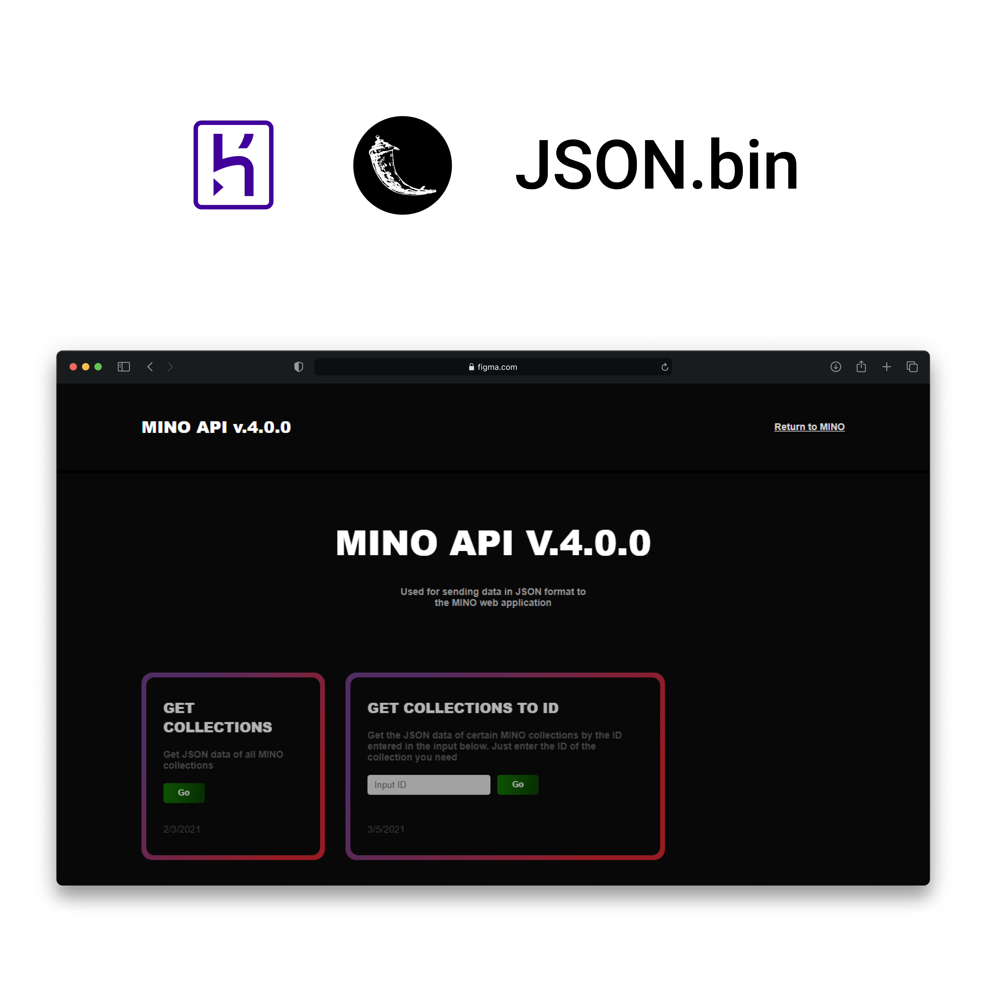

## REST API for the MINO repository

**Live preview [API]**

**Deployed thanks to [Heroku]**  
**Database: [JSON.bin]**  
**Production server: [Gunicorn]**  

## Useful documentation

- **https://flask.palletsprojects.com/en/1.1.x/**
- **https://habr.com/ru/post/346306/**
- **https://pythonru.com/uroki/7-osnovy-shablonizatora-jinja**

[Heroku]: <https://dashboard.heroku.com/>
[Python]: <https://www.python.org/>
[API]: <https://mino-api-please.herokuapp.com/>
[JSON.bin]: <https://jsonbin.io/>
[Gunicorn]: <https://gunicorn.org/>
